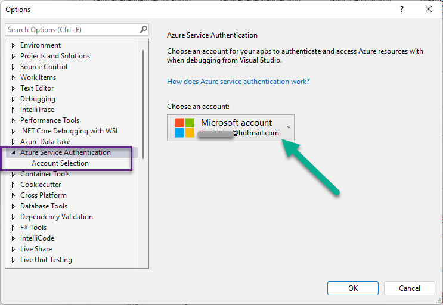

# Read Azure KeyVault from azure functions by azure managed identity

Read Azure KeyVault from Azure Functions (**v4** on **.net 6** ) By Azure **Managed Identity** .

Configurations:

1. Assigne your azure identity with appropriate secret permissions at "Access policies" for the key vault.
2. Use your azure identity in VS2022 in order to run debug at your credential.

   

You can reach me at [https://www.linkedin.com/in/bozhiqian/](https://www.linkedin.com/in/bozhiqian/)
